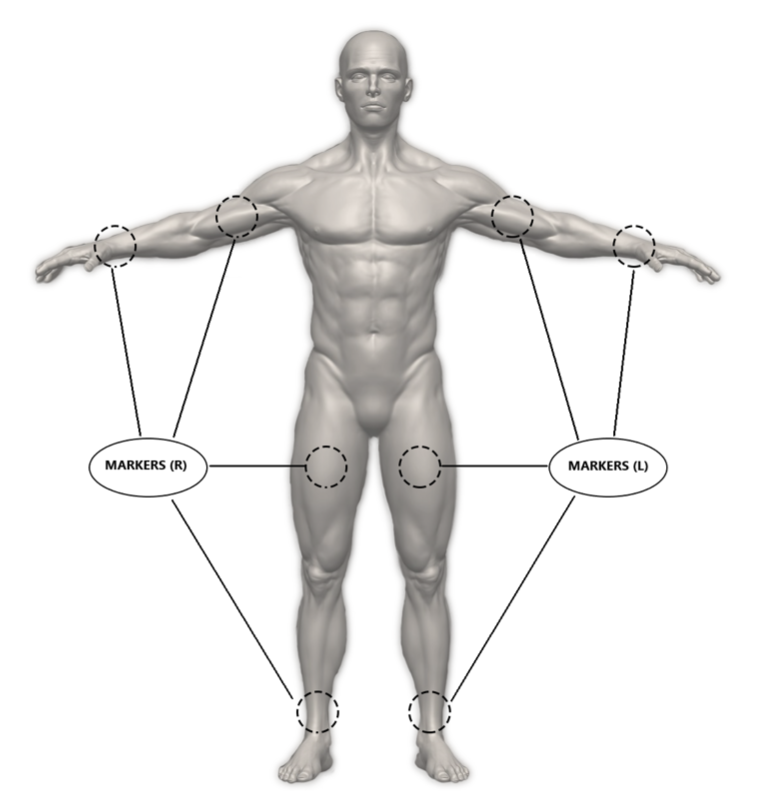
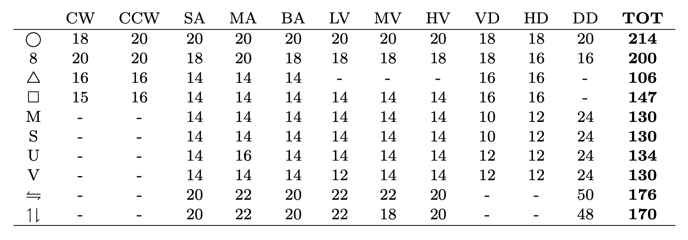

# A Random Forest-based Approach for Hand Gesture Recognition
Gesture Recognition has a prominent importance in smart environment and home automation. Thanks to the availability of Machine Learning approaches it is possible for users to define gestures that can be associated with commands for the smart environment. 

### Project Objectives
In this project we propose a Random Forest-based approach for Gesture Recognition of hand movements starting from wireless wearable motion capture data. In the presented approach, we evaluate different feature extraction procedures to handle gestures and data with different duration.

### Project Organization
```
.
├── src/                                        : Contains report images
├── GR_Dataset.mat                              : Gesture dataset as MATLAB table
├── Gesture_Classification.m                    : Main routine
├── gesturePreprocessing.m                      : Preprocessing function for feature extraction
├── custom_MCCV.m                               : Custom function for Stratified Monte Carlo Cross Validation
├── Mdl_best_<PREPROCESSING_TYPE>.mat           : Models pretrained on <PREPROCESSING_TYPE> features and ready to use
└── README.md                                   : Project Report 
```

## Data Description

The dataset is composed of three-dimensional position data, gathered from 12 infrared video cameras at 340Hz, of 8 photo-reflexive markers placed in areas of the body that should allow a good characterization of the gesture, with the future goal of making it possible data collection in everyday applications, using consumer wearable devices. In data acquisition sessions, gestures were performed statically (i.e. standing still in the same point of the space) and through the use of the right arm only (on the frontal plane). The categories of gestures for which data were collected are 10: circle shape (O), eight shape (8), square shape (:black_square_button:), triangle shape (△), M shape (M), S shape (S), U shape (U), V shape (V), vertical movement (||) and horizontal movement (=). With the purpose of providing greater intra-class variability, for each gesture category we considered 11 different modes of execution: clockwise (CK), counterclockwise (CCK), small amplitude (SA), medium amplitude (MA), big amplitude (BA), low velocity (LV), medium velocity (MV), high velocity (HV), vertical deformation (VD), horizontal deformation (HD) and diagonal deformation (DD).

The number of single executions for each gesture category-mode pair is reported in the table below.
<p align="center">
 
</p>

The dataset, complete of the raw Motion Capture data, can also be retrived in a more _cpython-oriented_ format (`.pickle`) in the [GitLab page](https://gitlab.dei.unipd.it/dl_dei/gesture_recognition) of the Department of Information Engineering of the University of Padova.

## Project Report
The detailed results of this project have been presented at the 5th IFAC Conference on Intelligent Control and Automation Sciences at ICONS 2019 in Belfast, United Kingdom, and the complete report has been [published](https://www.sciencedirect.com/science/article/pii/S2405896319307591) by Elsevier. :memo:

### Aknowledgments
I wish to thank my project supervisors and co-authors A. Cenedese, G.A. Susto, M. Carletti, and M. Terzi for their support and their advices.
